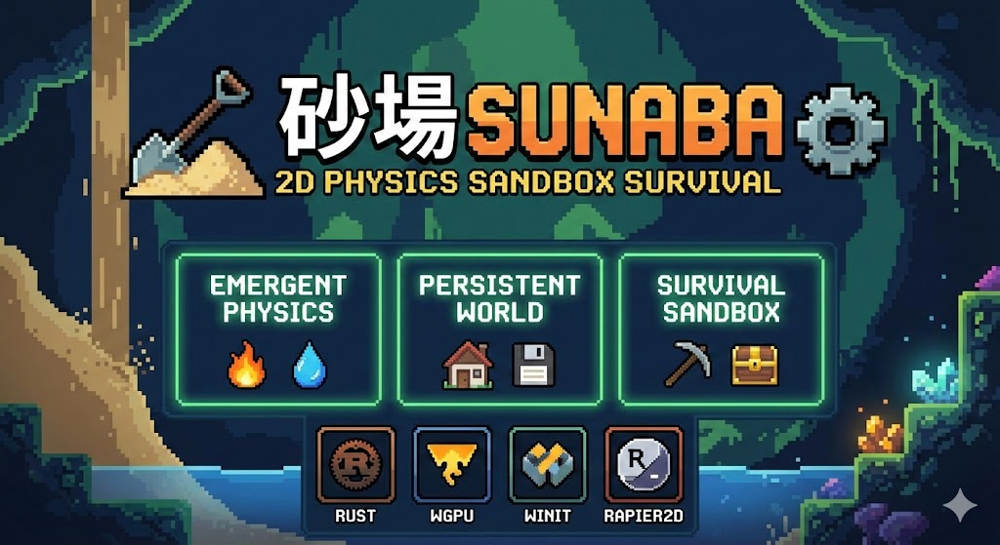

# Sunaba 砂場（すなば）

[](https://github.com/arturh85/sunaba/actions/workflows/ci.yml)
[](https://codecov.io/gh/arturh85/sunaba)
[](https://arturh85.github.io/sunaba/)
[](https://opensource.org/licenses/MIT)



A 2D falling-sand physics sandbox survival game featuring ML-evolved creatures with articulated bodies and emergent behaviors, inspired by Noita and Terraria.

## Features (Planned)

- **Emergent Physics**: Every pixel is simulated with material properties
- **Chemistry System**: Materials react with each other (fire spreads, water evaporates, acid dissolves)
- **Runtime-Switchable Multiplayer**: Real-time multiplayer via SpacetimeDB
  - Start in singleplayer, connect/disconnect on-demand (press M key)
  - World persistence: singleplayer world saved and restored
  - Auto-reconnect with exponential backoff
  - Server-side creature AI and physics with deterministic RNG
- **ML-Evolved Creatures**: Pre-evolved populations with diverse morphologies and behaviors
  - Articulated bodies controlled by neural networks (CPPN-NEAT + MAP-Elites)
  - Emergent survival strategies: hunting, building, tool use, social behaviors
  - Taming and selective breeding with genetic crossover
  - Meaningful world interactions: mining, construction, combat
- **Persistent World**: Changes persist across sessions
- **Survival Gameplay**: Crafting, building, exploration, creature management

## Downloads

- **Native Builds**: Download from [GitHub Releases](https://github.com/arturh85/sunaba/releases/)
- **Web Version**: Play at [https://arturh85.github.io/sunaba/game/](https://arturh85.github.io/sunaba/game/)

## Documentation

- [Technical Docs](https://arturh85.github.io/sunaba/) — CPPN-NEAT, MAP-Elites, cellular automata, and system architecture
- [Infographic](https://arturh85.github.io/sunaba/sunaba_infographic.png) — Visual overview (NotebookLM)
- [Slides](https://arturh85.github.io/sunaba/sunaba_slides.pdf) — Presentation deck (NotebookLM)
- [Video Explainer English](https://youtu.be/40-xBt8KpDY) (alternative [german](https://youtu.be/5yHAeTaHZjY) version, both NotebookLM)

## Building

Development works on Windows, Linux and MacOS.

Requires [Rust](https://www.rust-lang.org/tools/install) 1.56 or later and [Just](https://github.com/casey/just) as a command runner.

### Native Builds

```bash
# Start the game using a newly generated world
just start

# Start the game loading the existing world
just load
```

### Web Build (WASM)

The game can run in browsers that support WebGPU (Chrome 113+, Edge 113+, Firefox/Safari with WebGPU enabled).

```bash
just web
```

### Multiplayer (SpacetimeDB)

Sunaba supports **runtime-switchable multiplayer** via [SpacetimeDB](https://spacetimedb.com/). Start in singleplayer, connect to servers on-demand, switch back anytime.

**Quick Join:**

```bash
# Start in singleplayer (default)
just start

# Connect to local dev server on startup
just join-local

# Connect to production server on startup
just join-prod

# Connect to custom server
cargo run --features multiplayer_native -- --server https://your-server.com
```

**In-Game Connection:**
- Press `M` key to open multiplayer panel
- Select from predefined servers or enter custom URL
- Click "Connect" to join, "Disconnect" to return to singleplayer
- Your singleplayer world is saved before connecting and restored when you disconnect

**Connection Flow:**
- **Singleplayer → Multiplayer:** Saves your world, switches to server-authoritative mode
- **Multiplayer → Singleplayer:** Restores your world from snapshot
- **Auto-Reconnect:** Exponential backoff on connection loss (1s, 2s, 4s, 8s, max 30s)

**Server Setup (for hosting):**

```bash
# Install SpacetimeDB CLI (first time only)
curl --proto '=https' --tlsv1.2 -sSf https://install.spacetimedb.com | sh

# Start local server
just spacetime-start

# Build and publish the server module
just spacetime-build
just spacetime-publish-local

# View server logs
just spacetime-logs-tail
```

**Development Workflow (schema changes):**

After modifying `crates/sunaba-server/src/`:

```bash
just spacetime-build           # Rebuild server WASM
just spacetime-generate-rust   # Regenerate Rust client
just spacetime-generate-ts     # Regenerate TypeScript client
just test                      # Validate both clients match server
```

**Architecture:**

- **Native Client:** Auto-generated Rust SDK (gitignored, regenerated on build)
- **WASM Client:** Auto-generated TypeScript SDK (gitignored, regenerated on build)
- **Server:** WASM module with scheduled reducers (60fps world, 30fps creatures)

**Safety:** Both clients are fully auto-generated and type-safe. Generated code is gitignored and regenerated on every build, ensuring clients always match the server schema. No manual maintenance required.

**Server Features:**

The multiplayer server runs the same simulation code as the native game:
- ✅ Full CA physics (falling sand, fire, reactions)
- ✅ Server-side creature AI (neural network inference)
- ✅ Deterministic RNG via `ctx.rng()` for consistency
- ❌ No evolution/training (feature-gated out for WASM)

The server compiles **without** `evolution` and `regeneration` features, eliminating the `rand` dependency. SpacetimeDB provides its own deterministic RNG via `ctx.rng()`, ensuring server-client consistency.

See [CLAUDE.md](CLAUDE.md#spacetimedb-multiplayer-architecture) for detailed multiplayer architecture.

### Tests

To run all checks and tests, run before submitting a PR:

```bash
just test
```

### Creature Evolution Training

Train ML creatures using headless evolution with MAP-Elites and CPPN-NEAT:

```bash
# Quick training run (10 generations, 20 population) - good for testing
just train-quick

# Default training (100 generations, 50 population, locomotion scenario)
just train

# Full training run (500 generations, 100 population)
just train-full

# Custom training with specific parameters
just train scenario=foraging generations=200 population=75
```

Available training scenarios:
- `locomotion` - Evolve creatures that move efficiently across flat terrain
- `foraging` - Evolve creatures that find and consume food sources
- `survival` - Evolve creatures that avoid hazards (lava pits)
- `balanced` - Multi-objective: locomotion + foraging combined

Training outputs are saved to `training_output/` by default:
- `index.html` - Visual report with fitness charts and MAP-Elites grid
- `summary.json` - Machine-readable training results
- `checkpoints/` - Saved best genomes at intervals

### CI/CD

The project includes GitHub Actions workflows for:

- **CI** (`ci.yml`): Automated builds and tests on Linux, Windows, and macOS for every push
- **Release** (`release.yml`): Creates release binaries for all platforms when you push a version tag
- **Pages** (`pages.yml`): Automatically deploys the web version to GitHub Pages on every push to main

To create a new release:
```bash
git tag v0.1.0
git push origin v0.1.0
```

## Name

砂場 (Sunaba) is traditionally written as “sand + place,” meaning sandbox in Japanese. 
In this project, the name is intentionally layered: while the reading remains Sunaba (すなば), 
the second kanji may shift between 庭 (garden), 生 (life), and 層 (stratum), each offering a different lens on the same world. 
Together, they reflect a space where simple particles form ecosystems, life emerges from matter, and deep layers of simulation accumulate over time. 
Like a sandbox in the truest sense, 砂場 is a place for experimentation and discovery, 
where complex behavior arises naturally from fundamental rules rather than scripted design.

## Development Status

🔬 **Research Phase** — Evolving the first viable creatures

### Foundation (Stable)
The simulation core is complete and battle-tested:
- Pixel physics: 32 materials with temperature, reactions, state changes
- Structural integrity with kinematic falling debris
- Persistent world with procedural cave generation
- Player systems: mining, crafting, inventory
- **Multiplayer**: SpacetimeDB server module with server-side simulation and creature AI

### Creature Evolution (Active Research)
Building the ML creature pipeline—currently exploring:
- **Locomotion**: Tuning motor control and body physics for reliable movement
- **Self-sustaining behaviors**: Creatures that find food and survive autonomously
- **Training pipeline**: MAP-Elites behavioral diversity, fitness functions
- **Morphology-controller coupling**: Bodies and brains that co-evolve together

What's working: CPPN-NEAT genomes, morphology generation, neural controllers,
6 training scenarios, HTML reports with GIF captures.

What we're learning: How to get creatures that actually walk, feed themselves,
and exhibit meaningful behaviors rather than twitching in place.

### Research Roadmap
These are experimental milestones, not promises:

**Near-term exploration:**
- Viable locomotion (creatures that reliably move across terrain)
- Foraging behavior (find and consume food sources)
- Survival pressure (avoid hazards, manage hunger)

**Future directions:**
- Multi-agent dynamics (predator-prey, competition, cooperation)
- Tool use and manipulation (mining, building)
- Pre-evolved creature library (diverse archetypes for gameplay)
- Survival integration (taming, breeding, player interaction)

## License

MIT
