# Architecture: System Design

This page provides technical diagrams showing how Sunaba's systems fit together. For code-level details, see the repository's CLAUDE.md file.

## High-Level System Overview

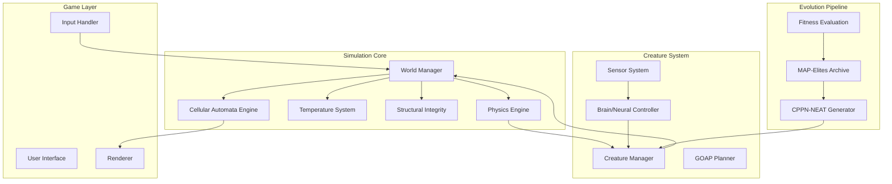

## Simulation Layers

The world simulation operates in layers with different update frequencies:

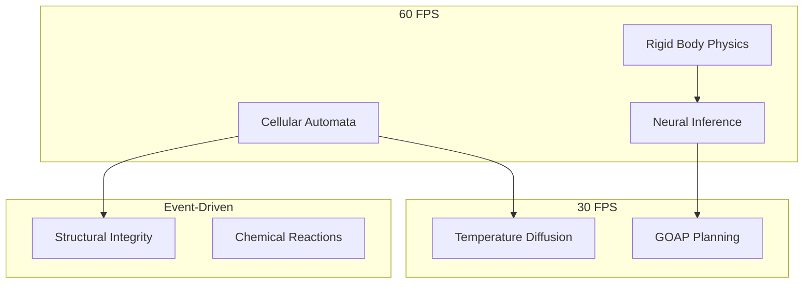

### Layer Interaction

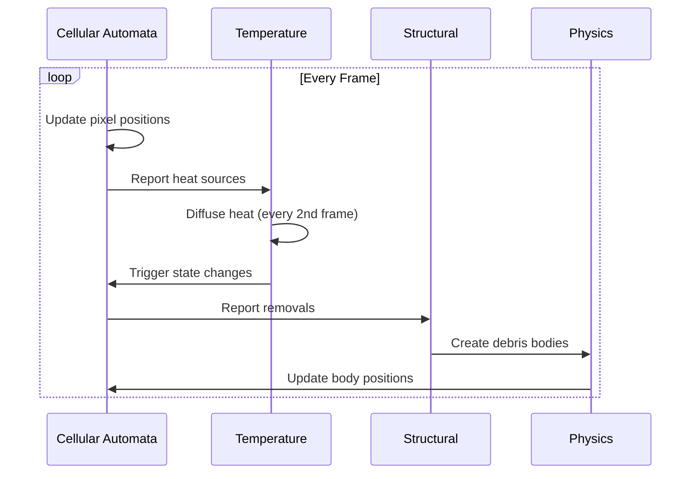

## World Structure

### Chunk Organization

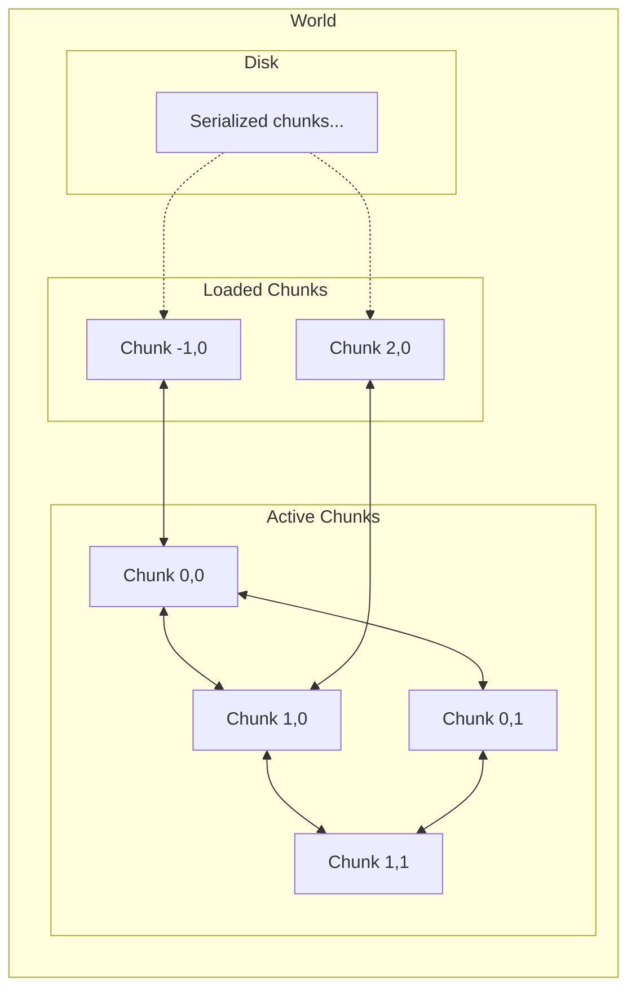

### Chunk Data Layout

```
Chunk (64×64 pixels)
├── pixel_data: [u32; 4096]
│   ├── bits 0-15:  material_id
│   ├── bits 16-23: flags
│   └── bits 24-31: variant/metadata
├── temperature: [f32; 64]  (8×8 coarse grid)
├── light: [u8; 4096]
└── dirty_rect: Option<Rect>
```

## Evolution Pipeline

### Offline Training Flow

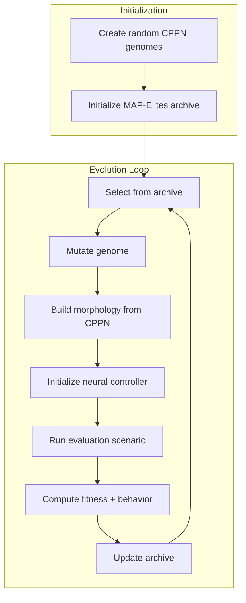

### CPPN Morphology Generation

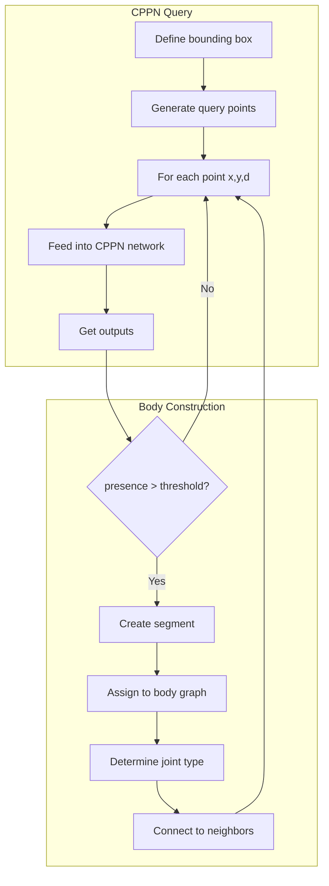

## Creature Lifecycle

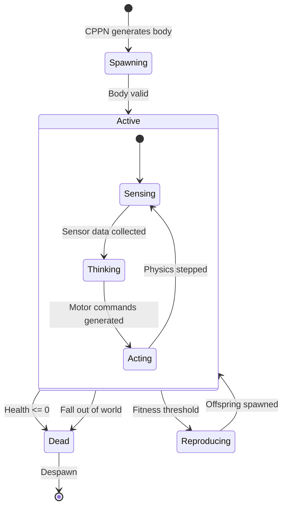

## Neural Control Pipeline

### Per-Frame Processing

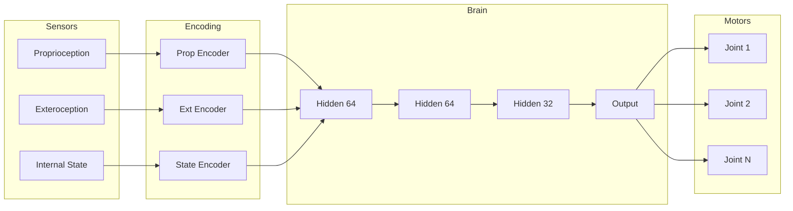

### Sensor Details

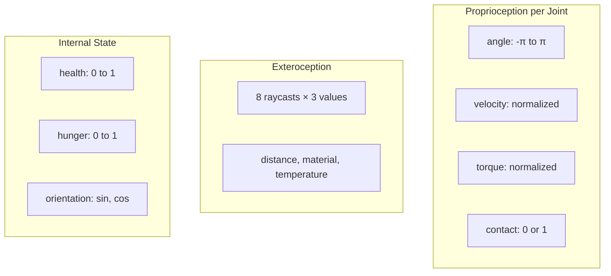

## Training Scenarios

### Scenario Types

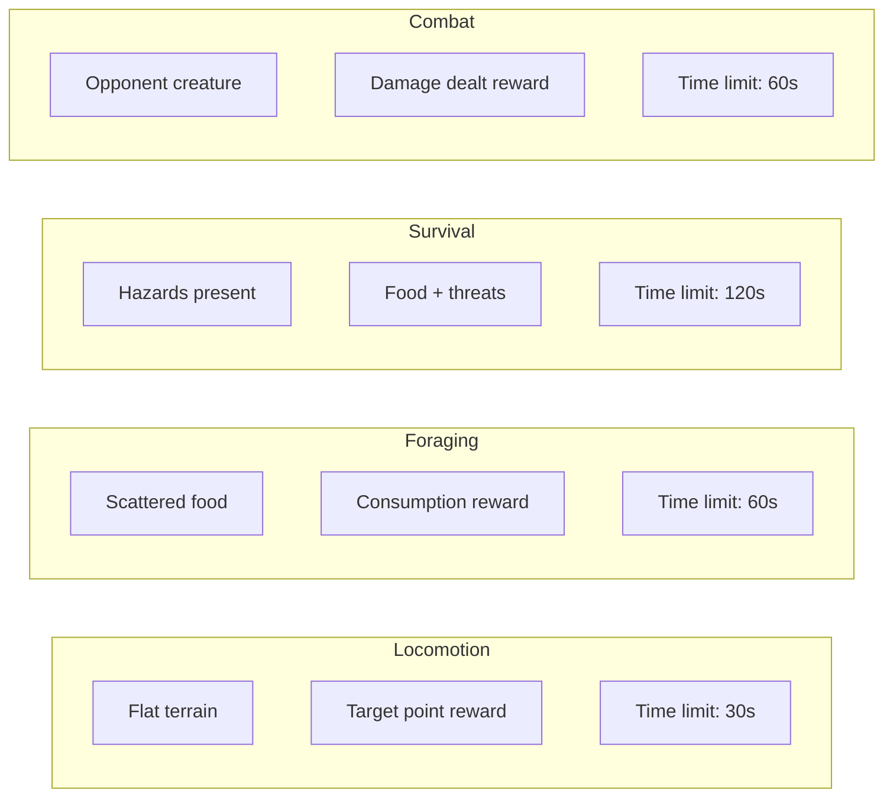

### Fitness Computation

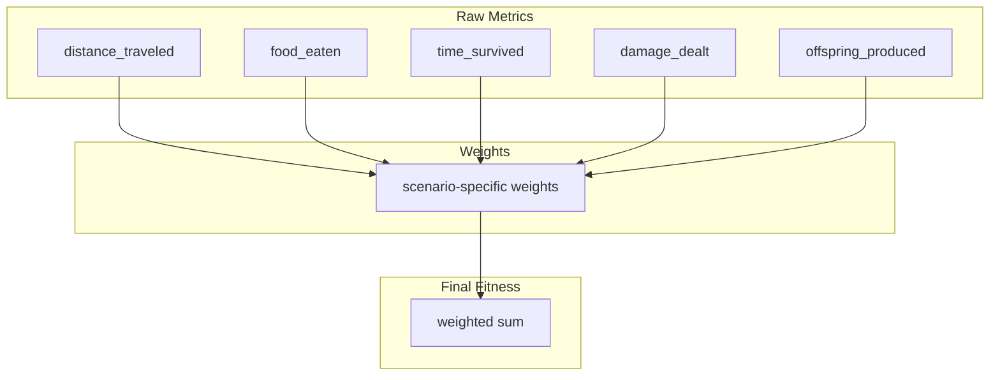

## MAP-Elites Archive

### Archive Structure

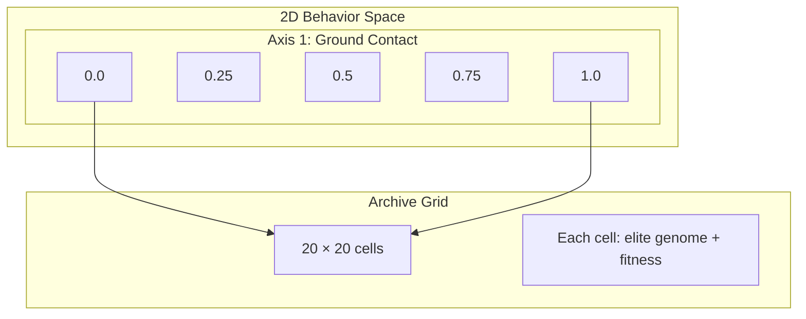

### Archive Operations

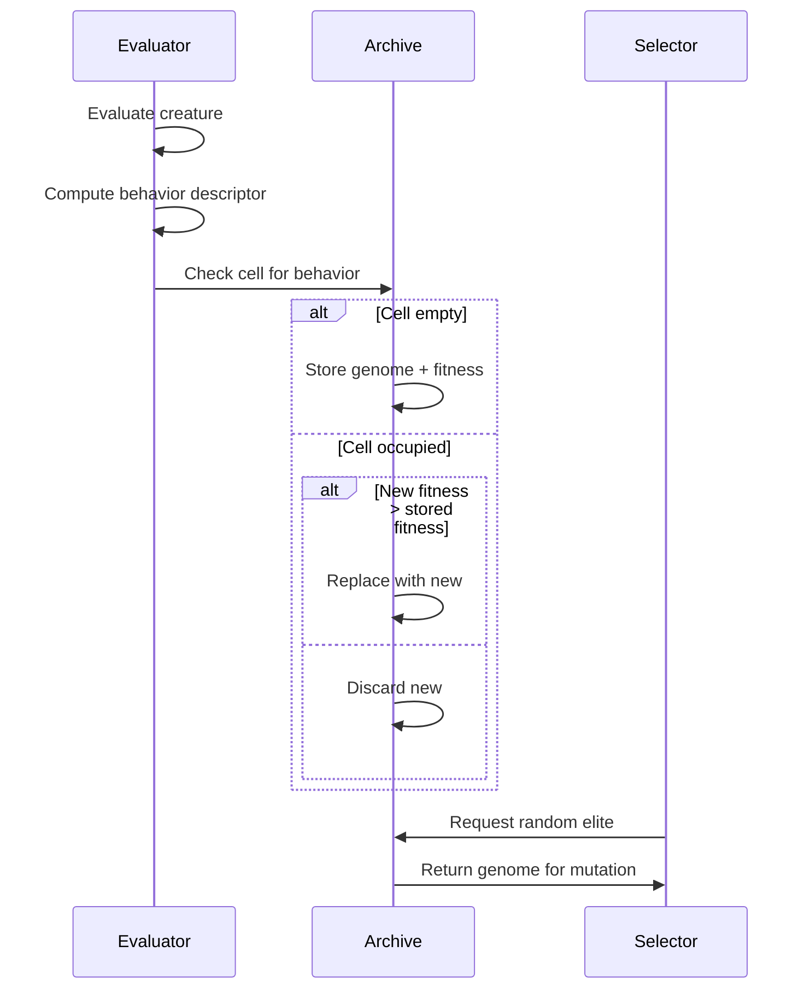

## Data Flow Summary

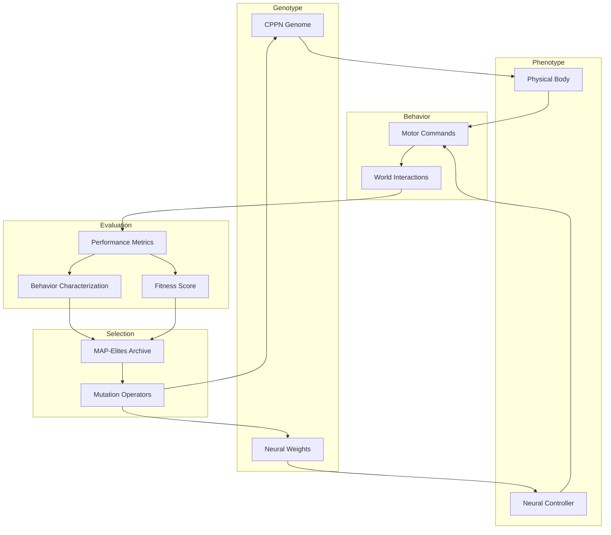

## User Interface

Sunaba's UI is built with egui, providing immediate-mode rendering for game controls and information displays.

### Inventory System


The inventory system supports:
- **Item Stacking**: Materials stack up to 999 per slot
- **Tool Durability**: Tools show remaining uses and degrade with use
- **Quick Access**: Hotbar for frequently used items
- **Visual Feedback**: Item icons with quantity displays

### Crafting System


The crafting interface provides:
- **Recipe Discovery**: Available recipes shown based on inventory
- **Material Requirements**: Clear display of required ingredients
- **Output Preview**: Shows crafted item before creation
- **Batch Crafting**: Support for creating multiple items at once

### Material Showcase


*Basic material showcase: 8 fundamental materials with distinct visual properties*


*Phase 5 materials: 30+ materials including ores, organics, refined materials, and special compounds*

### Lighting & World Systems


*Light propagation demonstration: underground lava, fire sources, and surface daylight*

### Structural Complexity


*Complex architectural structures demonstrating building capabilities*


*Tutorial level with resource distribution and starter area*

## Tech Stack Summary

| Component | Technology |
|-----------|------------|
| Language | Rust |
| Graphics | wgpu |
| UI | egui |
| Windowing | winit |
| Physics | rapier2d |
| Math | glam |
| Serialization | serde + bincode |
| Compression | lz4_flex |
| RNG | rand + rand_xoshiro |
| Graphs | petgraph |
