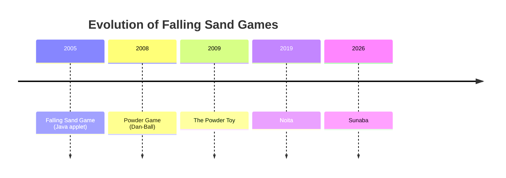
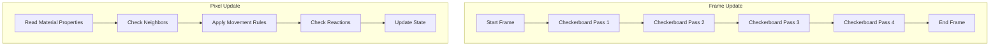
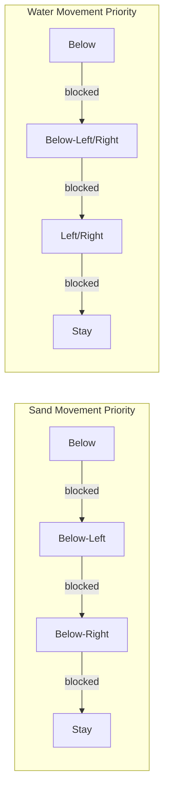
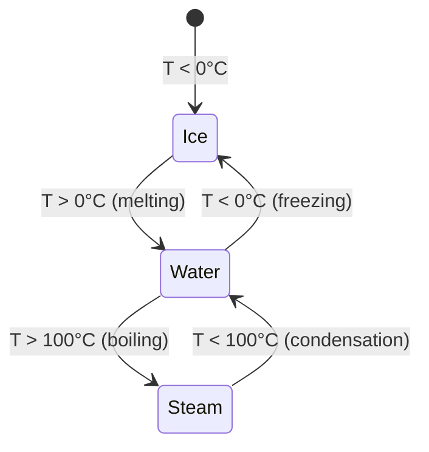
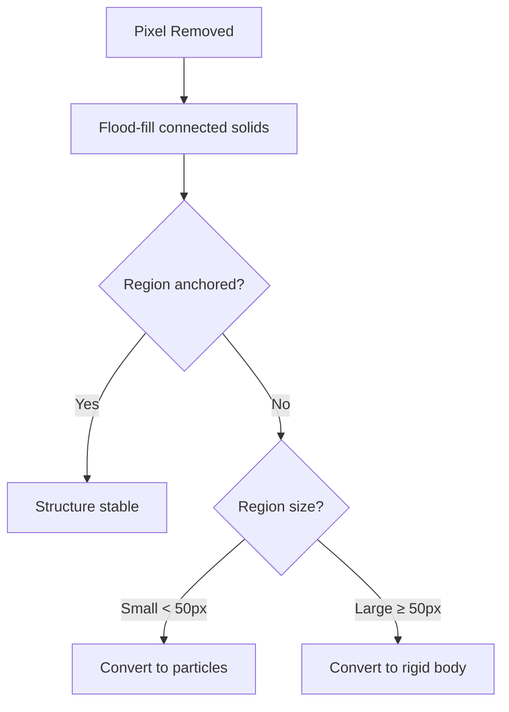

# Emergent Physics: Cellular Automata Foundations

Sunaba's world is built on cellular automata (CA) — a computational model where complex behaviors emerge from simple, local rules applied uniformly across a grid.

## A Brief History of Cellular Automata

### Von Neumann and Self-Replication (1940s)

John von Neumann, inspired by Stanislaw Ulam, developed the first cellular automaton to study self-replicating systems. His goal was to understand the logical requirements for a machine that could build copies of itself.

### Conway's Game of Life (1970)

John Conway's Game of Life demonstrated that four simple rules could produce extraordinary complexity:

1. Any live cell with fewer than two neighbors dies (underpopulation)
2. Any live cell with two or three neighbors survives
3. Any live cell with more than three neighbors dies (overpopulation)
4. Any dead cell with exactly three neighbors becomes alive (reproduction)

From these rules emerge gliders, oscillators, and even Turing-complete computation.

### Wolfram's Elementary Automata (1983)

Stephen Wolfram systematically studied one-dimensional CA, cataloging 256 possible rules. Rule 110 was proven Turing-complete, demonstrating that even the simplest CA can perform arbitrary computation.

> "It is possible to construct a universal computer within any rule 110 system."
> — Matthew Cook, 2004

## Falling Sand Games: CA for Material Simulation

Falling sand games apply cellular automata principles to simulate physical materials. Each pixel has a material type, and update rules determine how materials interact.

### The Lineage



### Why Falling Sand Works

Traditional physics engines simulate rigid bodies with explicit collision detection. Falling sand takes a fundamentally different approach:

| Aspect | Rigid Body Physics | Cellular Automata |
|--------|-------------------|-------------------|
| Unit | Objects with shape/mass | Individual pixels |
| Interactions | Collision detection | Neighbor rules |
| Complexity | O(n²) pairwise checks | O(n) local updates |
| Emergence | Limited | High |

The CA approach scales better and produces more emergent behaviors, at the cost of physical accuracy.

## Sunaba's Material System

### Material Properties

Each material in Sunaba is defined by a set of properties:

```
Material: Water
├── state: Liquid
├── density: 1.0
├── viscosity: 0.1
├── thermal_conductivity: 0.6
├── specific_heat: 4.18
├── boiling_point: 100°C
└── freezing_point: 0°C
```

Behaviors emerge from these properties, not from special-case code.

### Visual Demonstrations

#### Fire Propagation

<video width="640" height="360" controls loop>
  <source src="/videos/fire_spread.mp4" type="video/mp4">
  Fire spreading through wooden structures
</video>

Fire spreads through flammable materials when temperature exceeds ignition point. No explicit "fire spreading" code exists — the behavior emerges from:
- Wood's flammability property
- Fire's heat output
- Temperature diffusion
- Material state transitions

#### Liquid Physics

<video width="640" height="360" controls loop>
  <source src="/videos/water_flow.mp4" type="video/mp4">
  Water flowing down platforms
</video>

Liquids flow based on density, viscosity, and neighbor states. Water finds paths through gaps and pools at the lowest point through simple neighbor-checking rules.

#### Structural Dependencies

<video width="640" height="360" controls loop>
  <source src="/videos/bridge_collapse.mp4" type="video/mp4">
  Bridge collapse cascade
</video>

When a support pillar is removed, connected structures evaluate their support state. Unsupported sections convert to debris, triggering a cascade. This demonstrates emergent structural integrity from local connectivity checks.

#### Chemical Reactions

<video width="640" height="360" controls loop>
  <source src="/videos/lava_water_reaction.mp4" type="video/mp4">
  Lava and water reaction
</video>

Lava + Water → Steam + Stone demonstrates temperature-based state changes. The reaction emerges from material properties and temperature thresholds, not hardcoded behavior.

### The Update Algorithm

Sunaba processes pixels bottom-to-top, alternating horizontal direction each row to avoid directional bias:



The checkerboard pattern enables parallel chunk processing without race conditions.

### Movement Rules by Material State

**Solids:**
- Stationary unless unsupported
- Fall when no solid below
- Stack on other solids

**Powders:**
- Fall straight down if empty
- Slide diagonally if blocked below
- Pile at angle of repose

**Liquids:**
- Fall if space below
- Spread horizontally based on viscosity
- Equalize pressure across connected regions

**Gases:**
- Rise based on density difference with air
- Diffuse horizontally
- Fill enclosed spaces



## Temperature and State Changes

Sunaba implements a coarse-grained temperature simulation layered on top of the CA:

### Temperature Grid

Temperature is simulated on an 8×8 supergrid for performance:

```
64×64 pixel chunk
└── 8×8 temperature cells (8 pixels per cell)
    └── Heat diffusion at 30 FPS
```

### State Transitions

Materials transition between states based on temperature:



### Heat Diffusion

Heat spreads according to the discrete heat equation:

```
T(t+1) = T(t) + k * Σ(T_neighbor - T) / neighbors
```

Where `k` is the thermal conductivity of the material.

## Structural Integrity

When a solid structure loses its connection to anchored terrain, it must respond physically.

### The Flood-Fill Algorithm



### Debris Physics

Large disconnected regions become rigid bodies simulated by Rapier2D physics engine. This creates dramatic collapses and falling debris.

## Emergent Behaviors

None of these behaviors are explicitly programmed:

| Behavior | Emerges From |
|----------|--------------|
| Fire spreading | Temperature + flammability |
| Water erosion | Liquid movement + solid displacement |
| Cave-ins | Structural integrity + gravity |
| Steam geysers | Heat + water + pressure |
| Lava cooling | Heat transfer + state change |

## Noita: The State of the Art

Nolla Games' *Noita* (2019) represents the most sophisticated falling sand game to date. Their GDC 2019 talk revealed key techniques:

- Chunk-based parallel processing
- Material property matrices for reactions
- Rigid body integration for large debris
- GPU-accelerated rendering

Sunaba builds on these foundations while adding ML-evolved creatures.

## References

- Wolfram, S. (2002). *A New Kind of Science*. Wolfram Media.
- Gardner, M. (1970). "The Fantastic Combinations of John Conway's New Solitaire Game 'Life'." *Scientific American*.
- Cook, M. (2004). "Universality in Elementary Cellular Automata." *Complex Systems*.
- Nolla Games. (2019). "Exploring the Tech and Design of Noita." GDC Talk.
- The Powder Toy. (2009). Open-source falling sand game. https://powdertoy.co.uk/
