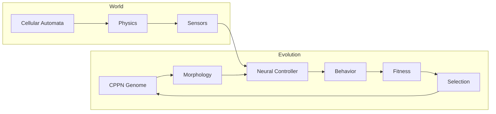

# Sunaba: Emergent Artificial Life

Sunaba is a research-oriented sandbox exploring the intersection of **emergent physics simulation** and **evolutionary artificial life**. This documentation provides scientific context for the algorithms and techniques employed.

## Play the Game

The playable web version is available at [/game/](game/).

## Visual Showcase

### Emergent Physics

<video width="640" height="360" controls loop autoplay muted>
  <source src="/videos/fire_spread.mp4" type="video/mp4">
  Fire spreading through wooden structures
</video>

*Fire propagates through flammable materials based on temperature and material properties*

<video width="640" height="360" controls loop autoplay muted>
  <source src="/videos/water_flow.mp4" type="video/mp4">
  Water flowing down platforms
</video>

*Liquids flow with realistic viscosity and density interactions*

### Structural Integrity

<video width="640" height="360" controls loop autoplay muted>
  <source src="/videos/bridge_collapse.mp4" type="video/mp4">
  Bridge collapse with cascade failure
</video>

*Structures collapse when support is removed, demonstrating emergent structural dependencies*

### Material Diversity

*37 unique materials with distinct properties and interactions*

*Extended material system: ores, organics, refined materials, and special compounds*

### Chemistry & Reactions

<video width="640" height="360" controls loop autoplay muted>
  <source src="/videos/lava_water_reaction.mp4" type="video/mp4">
  Lava meets water reaction
</video>

*Temperature-based state changes: lava + water → steam + stone*

<video width="640" height="360" controls loop autoplay muted>
  <source src="/videos/material_reactions.mp4" type="video/mp4">
  Multiple material reactions
</video>

*Comprehensive chemistry: gunpowder explosions, acid corrosion, organic transformations*

### Advanced Systems

<video width="640" height="360" controls loop autoplay muted>
  <source src="/videos/plant_growth.mp4" type="video/mp4">
  Plant growth under light
</video>

*Light propagation and organic growth systems enable renewable resources*

*Day/night cycle with realistic light propagation from multiple sources*

### User Interface

*Inventory management with item stacking and tool durability*

*Recipe-based crafting for material transformations*

## The Core Question

Can complex, adaptive behaviors emerge from the interaction of simple rules and evolutionary pressure?

This question has driven artificial life research since the field's start. Sunaba approaches it by combining two powerful paradigms:

1. **Pixel-based physics simulation** — where material behaviors emerge from cellular automata rules rather than hand-coded interactions
2. **Neuroevolution** — where creature morphologies and neural controllers co-evolve to survive in this emergent world

## Why Emergence Matters

Traditional game AI relies on explicitly programmed behaviors. A creature "knows" to hunt because a designer wrote hunting code. In contrast, emergent systems produce behaviors that were never explicitly programmed.

Consider fire spreading through a forest. In Sunaba:
- Wood has a property: `flammability`
- Fire has a property: `heat_output`
- A reaction rule exists: "if wood temperature exceeds ignition point, convert to fire"

No one programmed "forest fires." The behavior emerges from simple rules interacting.

The same principle applies to creatures. Their behaviors emerge from:
- Morphology generated by CPPN-NEAT
- Neural controllers evolved through MAP-Elites
- Selection pressure from the simulated environment

## Documentation Overview

| Section | Focus |
|---------|-------|
| [Emergent Physics](emergent-physics.md) | Cellular automata and falling sand simulation |
| [CPPN-NEAT](cppn-neat.md) | Procedural morphology generation |
| [MAP-Elites](map-elites.md) | Quality-diversity evolutionary optimization |
| [Neural Control](neural-control.md) | Brain architectures for embodied agents |
| [Prior Work](prior-work.md) | Literature review and inspirations |
| [Architecture](architecture.md) | System design with diagrams |

## Key Algorithms at a Glance

## References

This project builds on decades of research in artificial life, neuroevolution, and emergent simulation. Key influences include:

- Stanley, K.O. (2007). [Compositional Pattern Producing Networks](https://doi.org/10.1007/s10710-007-9028-8)
- Mouret, J.-B. & Clune, J. (2015). [Illuminating search spaces by mapping elites](https://arxiv.org/abs/1504.04909)
- Sims, K. (1994). [Evolved Virtual Creatures](https://www.karlsims.com/evolved-virtual-creatures.html)
- Nolla Games (2019). [Noita — Falling sand physics](https://www.gdcvault.com/play/1025695/)

See [Prior Work](prior-work.md) for a comprehensive literature review.
